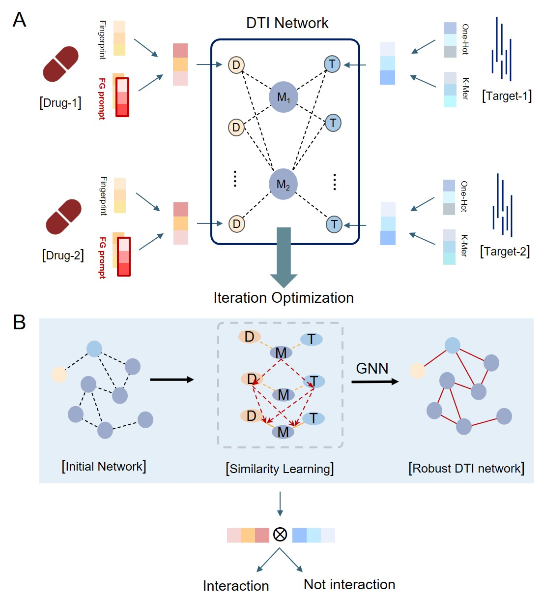

# AIGO-DTI
Predicting drug target interactions based on improved drug properties combined with adaptive iterative algorithms.

### Architecture   


# Usage
## How to use it?
Firstly, you need to open use.py
## 1. How to preprocess the raw data
For customized BindingDB dataset: 

```python
dataClass = DataClass(dataPath='data/Binding DB', 
                      pSeqMaxLen=1024, dSeqMaxLen=128)                       
```
>**dataPath** is the path of the customized Binding DB dataset. 

For other normal dataset,  model supports CSV and txt files, whose format is like below:
```
drug1 protein1 lab
drug2 protein2 lab
...
```
The class is simiar as before: 
```python
dataClass = DataClass_normal(dataPath='path to txt or csv', 
                             pSeqMaxLen=1024, dSeqMaxLen=128, 
                             sep=' ')                       
```
>**dataPath** is the path of txt file. 
>**sep** is the delimiter for each line of data in the txt file. It is ' ' or ',',  generally.  

## 2. How to train the models. 
Instance the model object and do training. 
```python
model = AIGO_DTI(args=args,log=log,cSize=dataClass.pContFeat.shape[1])
res = model.train(dataClass, args=args,stopRounds=-1,log=log,
            savePath='AIGO-DTI', metrics="AUC", report=["ACC", "AUC", "LOSS",'F1','Precision','AUPR'],
            preheat=0)
```

